# Architecture & Design

This document describes the internal architecture of the Pict Template Preprocessor, including how the trie-based template engine works, how the preprocessor compiles templates into cached segments, how the dependency graph is built, and how entity batch prefetch operates at TemplateSet boundaries.

## The Problem

Pict's MetaTemplate engine parses every template string character-by-character through a trie-based state machine on every render. For templates rendered repeatedly -- list items, re-renders, reactive updates -- this is redundant work because the structure of the template never changes, only the data does. The preprocessor eliminates this redundancy.

## System Overview

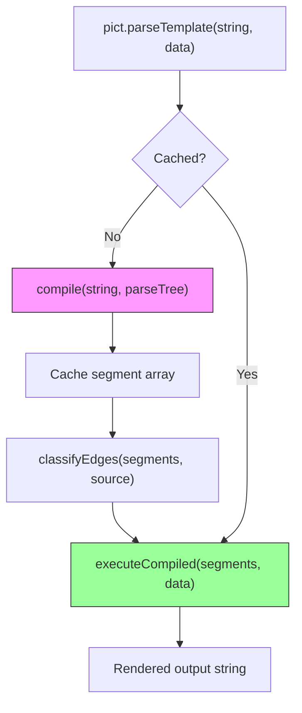

The preprocessor sits between Pict's public API and the MetaTemplate engine. On first encounter with a template string, it runs the full trie walk to produce segments. On subsequent encounters, it skips directly to execution.

## How the Trie Works

Pict's template engine uses [Precedent](https://github.com/stevenvelozo/precedent) to build a trie (prefix tree) from registered pattern delimiters. Every template expression type registers a start and end pattern pair.

### Pattern Registration

When a template expression class calls `this.addPattern('{~Data:', '~}')`, Precedent inserts each character of the start pattern into the trie as a path of nodes. The final node stores the Parse function and the end pattern.

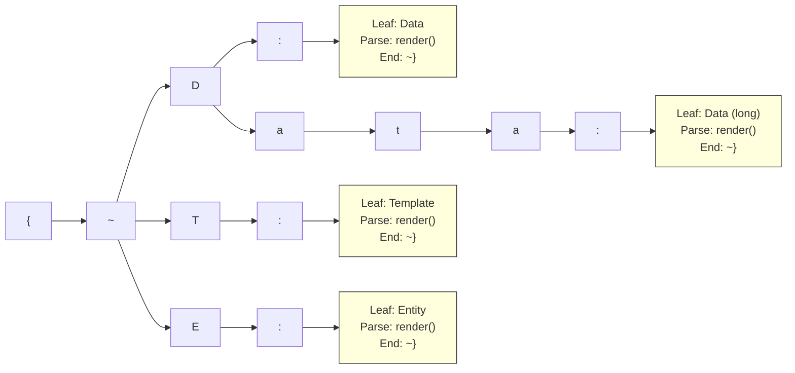

### Character-by-Character State Machine

The MetaTemplate string parser processes each character through a state machine with these transitions:

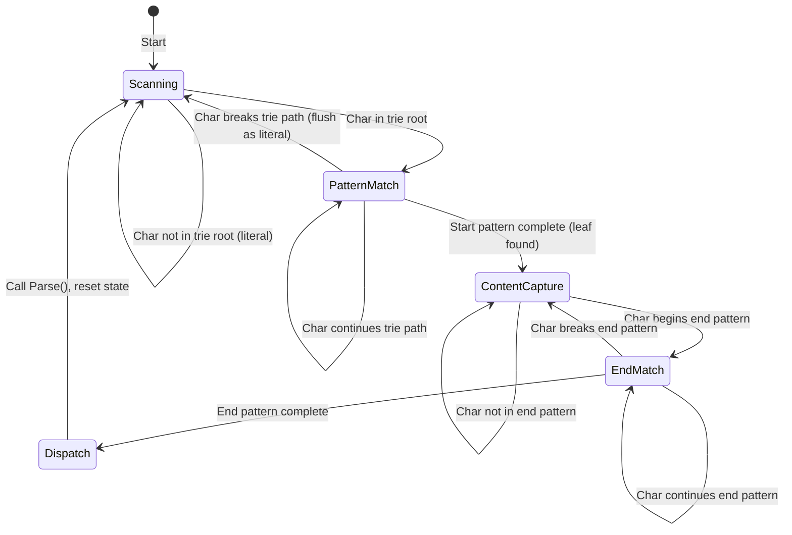

**Without the preprocessor**, this state machine runs on every `parseTemplate()` call. For a template rendered 1000 times with 200 characters, that is 200,000 character transitions where the structure is identical each time.

**With the preprocessor**, the state machine runs once to produce a segment array. The 999 subsequent renders iterate the segment array directly.

## Compiled Segment Format

A compiled template is an array of segment objects. There are two types:

### Literal Segments

```javascript
{ Type: 'Literal', Value: 'Hello ' }
```

Pre-extracted string content between expressions. During execution, the value is concatenated directly to the output with no processing.

### Expression Segments

```javascript
{
    Type: 'Expression',
    Hash: 'AppData.Name',     // Content between start/end tags
    Leaf: <trie leaf node>,   // Direct reference to the trie leaf
    Tag: '{~Data:'            // PatternStartString for classification
}
```

The `Leaf` property holds a direct reference to the trie leaf node, which contains:
- `Parse` - The synchronous render function
- `ParseAsync` - The asynchronous render function
- `ParserContext` - The `this` context for calling Parse (the template expression instance)
- `PatternStartString` / `PatternEndString` - The delimiter strings
- `isAsync` - Whether this expression requires async execution

By storing a direct reference to the leaf, the fast path avoids re-traversing the trie entirely.

## Compilation Algorithm

The `compile()` method mirrors the MetaTemplate string parser's state machine but records segments instead of executing Parse functions:

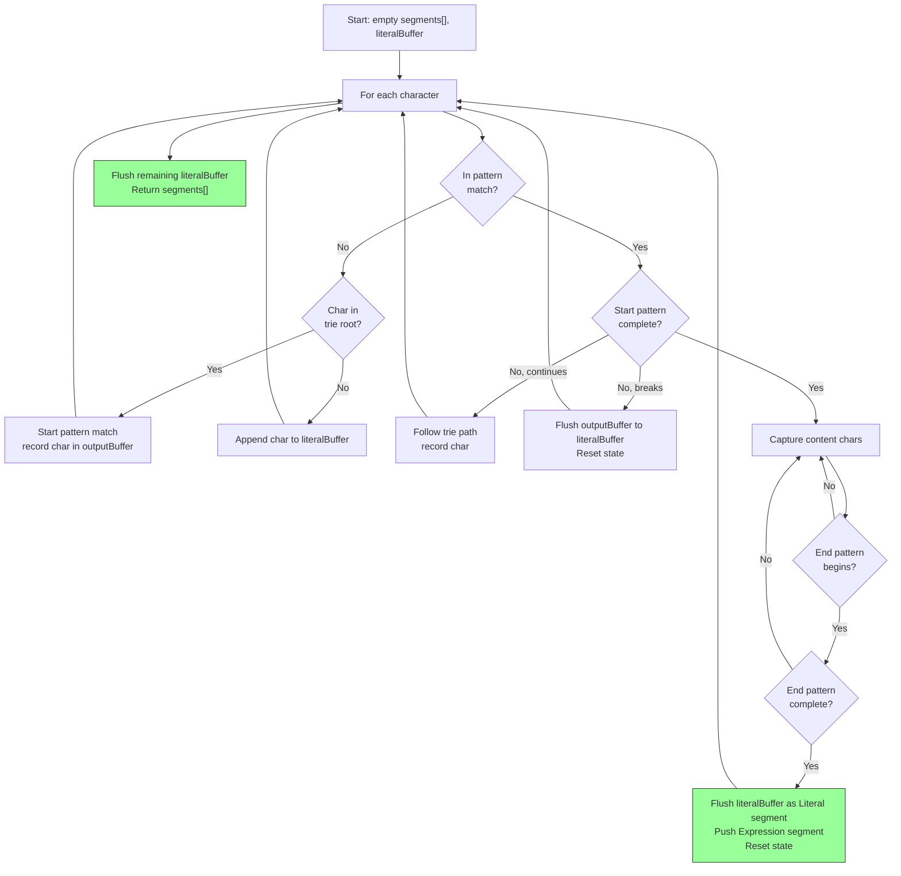

The key difference from the original parser: where the original calls `Parse(hash, data, ...)`, the compiler pushes `{ Type: 'Expression', Hash, Leaf, Tag }` to the segment array. The state transitions are identical to ensure perfect fidelity.

## Fast-Path Execution

### Synchronous Path

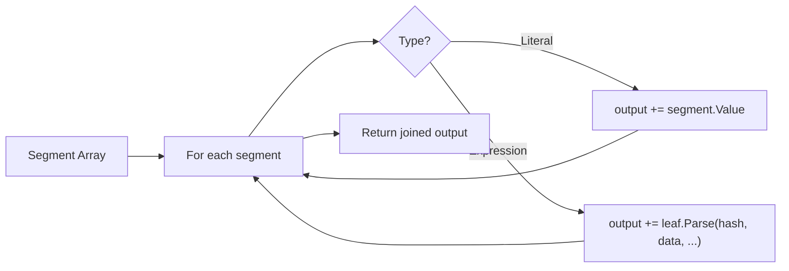

The synchronous fast path is a simple array iteration. No trie traversal, no state machine, no character-by-character scanning. Each Expression segment calls its Parse function by direct reference.

### Asynchronous Path

The async fast path uses Fable's Anticipate service to schedule each segment as a step in a waterfall:

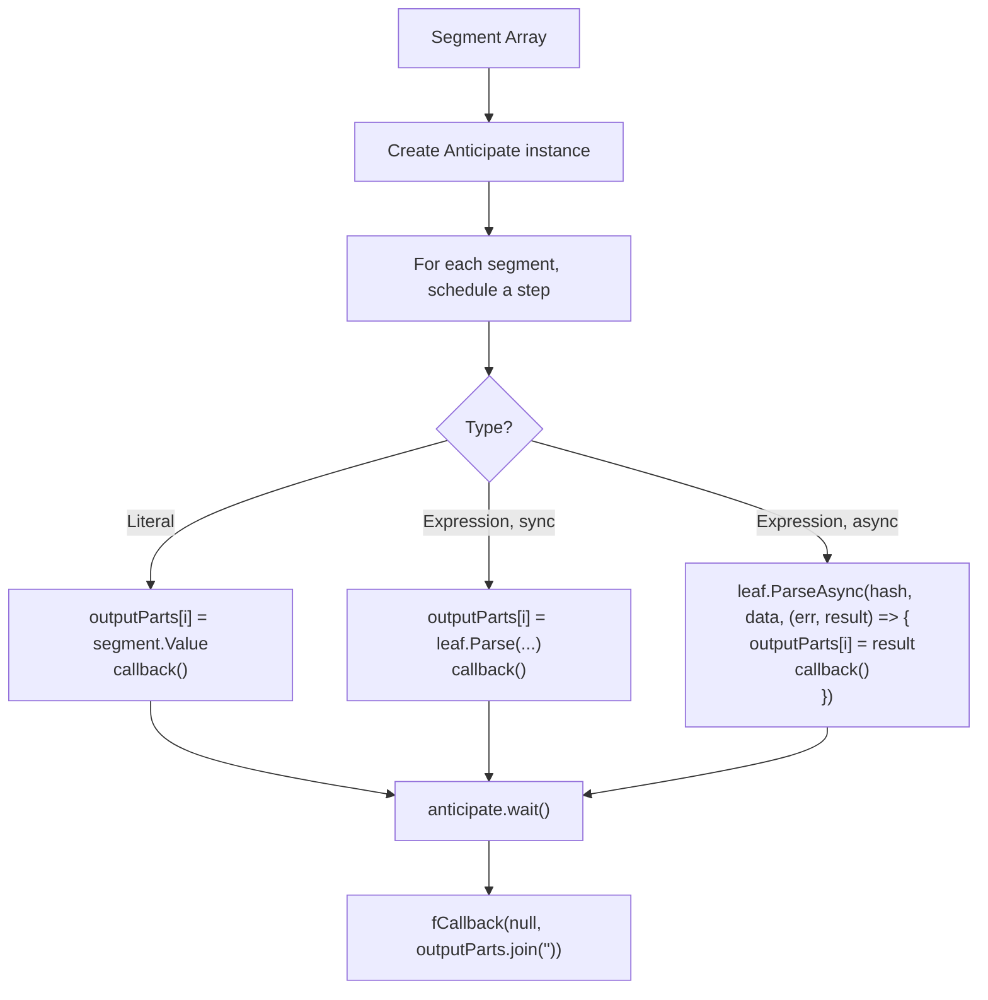

Only N steps are created (one per segment), compared to the original async parser which creates one step per character. For a template with 200 characters and 5 expressions, this is 7 steps instead of 200.

## Expression Dependency Graph

As templates are compiled, the preprocessor classifies each Expression segment and populates a directed graph.

### Graph Structure

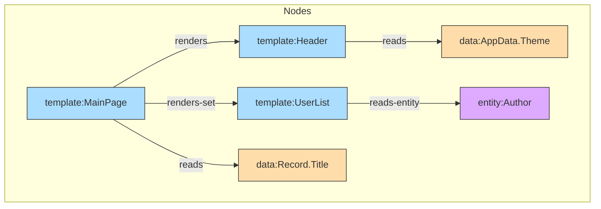

### Node Types

| Type | Description | Shape (DOT) |
|------|-------------|-------------|
| `template` | A named template hash | box |
| `data` | A data address path | ellipse |
| `entity` | An entity type name | diamond |

### Edge Types

| Edge Type | Source Tag | Meaning |
|-----------|-----------|---------|
| `renders` | `{~T:`, `{~Template:` | Source template renders target template |
| `renders-set` | `{~TS:`, `{~TemplateSet:` | Source renders target as a set iteration |
| `renders-if` | `{~TIf:`, `{~TemplateIf:` | Source conditionally renders target |
| `renders-if-else` | `{~TIfE:`, `{~TemplateIfElse:` | Source conditionally renders one of two targets |
| `reads` | `{~D:`, `{~Data:`, formatters | Source reads a data address |
| `reads-entity` | `{~E:`, `{~Entity:` | Source fetches an entity by type |

### Edge Classification

Edge classifiers are functions registered by PatternStartString. Each classifier receives the template hash (content between delimiters) and returns an array of edges to add:

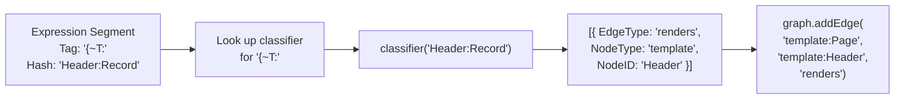

Custom classifiers can be registered for application-specific template expression types via `addEdgeClassifier()`.

## Entity Batch Prefetch

### The N+1 Problem

When a TemplateSet renders N records and each record contains an `{~Entity:~}` expression, the standard rendering path makes N individual HTTP requests -- one per record per entity type.

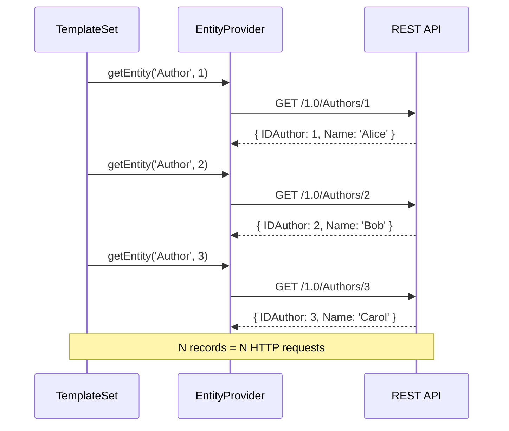

### Prefetch Solution

The preprocessor intercepts `parseTemplateSet()` on the async path and runs a prefetch phase before iteration:

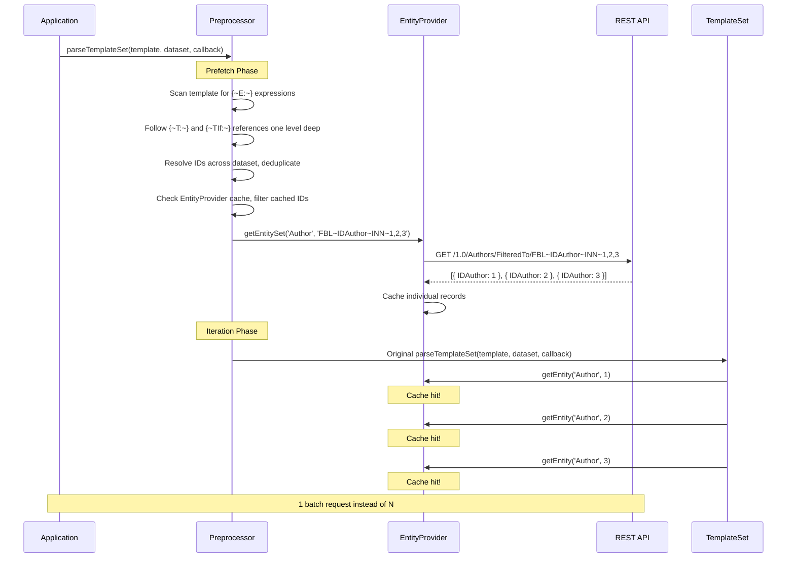

### Prefetch Depth

The prefetch scan follows template references one level deep. This covers the common case where entity expressions are in a child template rendered by the set's iteration template:

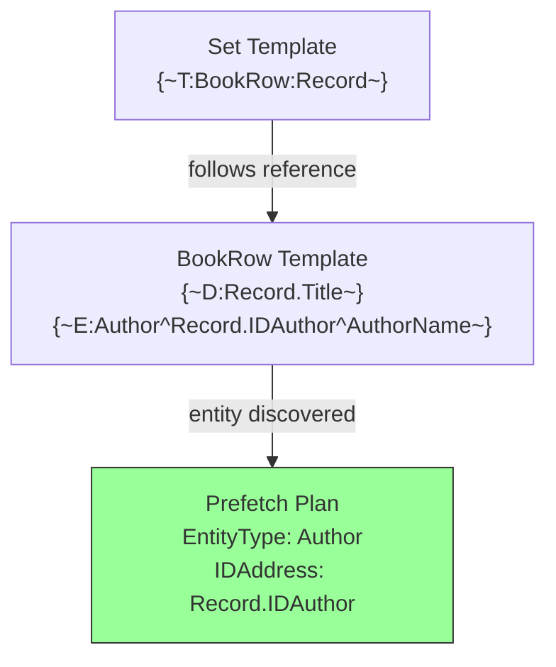

The scan follows `{~T:~}`, `{~TIf:~}`, `{~TIfE:~}`, and `{~TS:~}` references to discover entity expressions in child templates.

### ID Resolution

Entity IDs are resolved from the dataset using dot-notation path walking with support for standard address prefixes:

| Prefix | Resolves From |
|--------|---------------|
| `Record.` | Each record in the dataset |
| `AppData.` | The Pict AppData store |
| `Scope.` | The scope object |
| `Context[N].` | The Nth context array element |

IDs are deduplicated across the dataset and checked against the EntityProvider cache before fetching. Only uncached IDs are included in the batch request.

## Interaction with Template Audit

Both the preprocessor and [pict-template-audit](https://github.com/stevenvelozo/pict-template-audit) wrap Pict's template methods. If both are active, instantiation order matters:

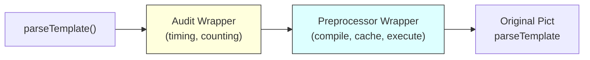

The preprocessor should be instantiated first (inner wrapper), and the audit second (outer wrapper). This way the audit measures the time of the fast path rather than the original slow path.

## Cache Semantics

The compiled template cache is a `Map<string, Array<Segment>>` keyed by the raw template string. Cache behavior:

- **Key**: The exact template string passed to `parseTemplate()`. Two templates with different whitespace are different cache keys.
- **Lifetime**: Cache entries persist for the lifetime of the preprocessor instance. Call `clearCache()` to invalidate all entries.
- **Thread safety**: JavaScript is single-threaded; no concurrency concerns.
- **Memory**: Each cached entry stores the segment array plus references to existing trie leaf nodes. The overhead per template is proportional to the number of segments, not the string length.
- **Invalidation**: If template expressions are registered or unregistered after compilation, cached segments may reference stale trie leaves. Call `clearCache()` after modifying the pattern trie.

## Module Architecture

```
pict-template-preprocessor/
    source/
        Pict-Template-Preprocessor.js         # Service class, compile, execute, prefetch, wrappers
        Pict-Template-Preprocessor-Graph.js   # TemplateGraph class (nodes, edges, query, export)
    test/
        Pict-Template-Preprocessor_test.js    # 40 unit tests
    docs/
        README.md                             # Documentation landing page
        quickstart.md                         # Getting started guide
        architecture.md                       # This document
        implementation-reference.md           # Behavioral details
        api/                                  # Per-function reference docs
    package.json
```

The preprocessor is a standalone npm package with a single runtime dependency (`fable-serviceproviderbase`). It consumes Pict as a dev dependency for testing. It does not modify any Pict source files; all integration is through runtime method wrapping.
